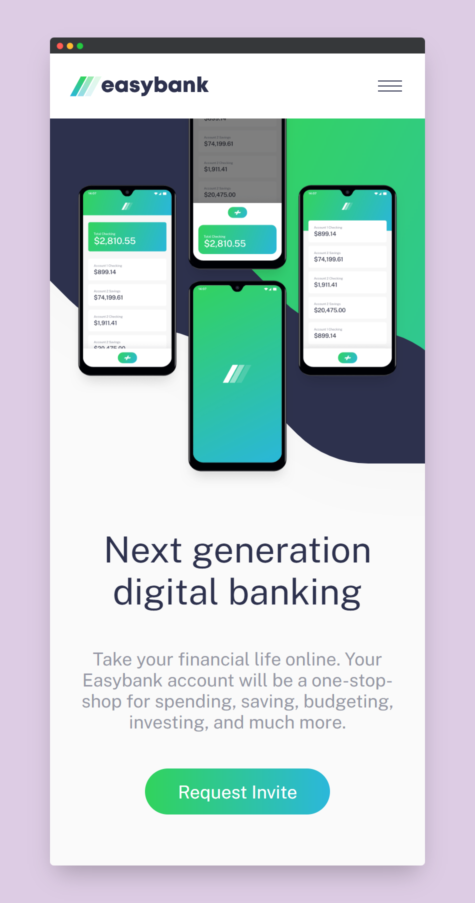

# Frontend Mentor - Easybank landing page solution

This is a solution to the [Easybank landing page challenge on Frontend Mentor](https://www.frontendmentor.io/challenges/easybank-landing-page-WaUhkoDN). Frontend Mentor challenges help you improve your coding skills by building realistic projects. 

## Table of contents

- [Overview](#overview)
  - [The challenge](#the-challenge)
  - [Screenshot](#screenshot)
  - [Links](#links)
- [My process](#my-process)
  - [Built with](#built-with)
- [Author](#author)

## Overview

### The challenge

Users should be able to:

- View the optimal layout for the site depending on their device's screen size
- See hover states for all interactive elements on the page

### Screenshot

- Solution URL: [https://github.com/appbraham/easybank-landing-page.git](https://github.com/appbraham/easybank-landing-page.git)
- Live Site URL: [https://easybank-landing-page-three-virid.vercel.app/](https://easybank-landing-page-three-virid.vercel.app/)

## My process

### Built with

- Semantic HTML5 markup
- CSS custom properties
- Flexbox
- CSS Grid
- Mobile-first workflow

## Author

- Website - [Abraham Gutierrez](https://github.com/appbraham)
- Frontend Mentor - [@appbraham](https://www.frontendmentor.io/profile/appbraham)
- Twitter - [@appbraham](https://www.twitter.com/appbraham)